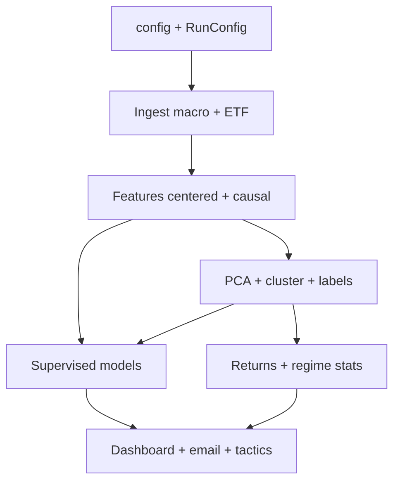

# Rebuilding Trading-Crab from scratch — comprehensive guide

**Audience:** Future you, or a **new repository** that will use this codebase as a **read-only submodule**, **GSD** for planning, and **Cursor** (or similar) for implementation.

**What this document is:** A **design manual** and **execution playbook** in one. It tries to capture:

- The **logical order** in which a project *like* Trading-Crab should be built.
- **Why** that order beats “implement features in historical accident order.”
- **Tests and critiques** at each layer so you catch look-ahead bias, silent mis-labeling, and config drift *early*.
- **Lessons** from building this repo without ideal GSD granularity at the start—so you don’t repeat them.

**What it is not:** A line-by-line porting checklist of every file. The reference implementation lives in `src/trading_crab_lib/`, `pipelines/`, `config/`, and `tests/`. This guide tells you **what to build, verify, and in what sequence**—not to duplicate every function name.

**Companion reads in this repo:** `CLAUDE.md` (map + CLI), `ARCHITECTURE.md` (invariants), `RUNBOOK.md` (operations + `market_code`), `config/settings.yaml` (tunables).

---

## Table of contents

1. [The essence — one page](#1-the-essence--one-page)
2. [Accuracy & limits of this guide](#2-accuracy--limits-of-this-guide)
3. [Vocabulary & system boundaries](#3-vocabulary--system-boundaries)
4. [First principles (non-negotiable)](#4-first-principles-non-negotiable)
5. [Dependency graph — why order is not arbitrary](#5-dependency-graph--why-order-is-not-arbitrary)
6. [What we did well vs what we’d redo (process)](#6-what-we-did-well-vs-what-wed-redo-process)
7. [Milestone map (greenfield)](#7-milestone-map-greenfield)
8. [Granular build sequence — phases, substeps, tests, critiques](#8-granular-build-sequence--phases-substeps-tests-critiques)
9. [Cross-cutting systems](#9-cross-cutting-systems-checkpoints-market_code-preservation)
10. [Testing strategy — tiers](#10-testing-strategy--tiers)
11. [Risk register](#11-risk-register)
12. [Anti-patterns (learned the hard way)](#12-anti-patterns-learned-the-hard-way)
13. [GSD, planning files, submodule workflow](#13-gsd-planning-files-submodule-workflow)
14. [Appendix — step index, checklist, open questions](#appendix-a-pipeline-step-index-this-repo)

---

## 1. The essence — one page

**Problem:** Turn decades of macro + ETF history into **interpretable regimes**, **honest predictions** (no look-ahead), and **actionable** ETF-level guidance.

**Core trick:** Split the world into two **feature universes** that share column names but differ in how rolling smoothers use time:

| Universe | Smoothing | Used for |
|----------|-------------|----------|
| **Non-causal / centered** | Past + future neighbors in windows | Clustering, regime labels, profiling (offline “what did regimes look like?”) |
| **Causal** | Past-only windows | Supervised models, anything you’d score “as of quarter end” in production |

If you train or score **supervised** models on **centered** features, you bake in **future information**. That is the #1 silent failure mode.

**Build order (cannot shortcut without debt):**

1. **Skeleton** — package, config load, logging, `RunConfig`, checkpoint abstraction, CLI.
2. **Data** — macro + ETF ingestion, publication lag for slow-release series, checkpoints.
3. **Features** — fixed pipeline order (ratios → log → select → gap-fill → derivatives → select); **two parquet outputs** for centered vs causal.
4. **Regimes** — PCA (fixed *k* components), clustering (standard + balanced), persist labels; **pin human names** in YAML.
5. **Supervised** — current regime + forward horizons; **TimeSeriesSplit**-style validation; train **only** on causal features.
6. **Assets** — quarterly returns, regime-conditional stats, rankings, portfolio helpers.
7. **Product** — dashboard, weekly report, email, tactics/diagnostics — **after** the pipeline is honest.

Everything else (extra FRED series, macrotrends, LightGBM, narrative AI reports) is **Tier 2** on top of a correct core.

---

## 2. Accuracy & limits of this guide

**Accurate relative to this repository:** The pipeline stages, dual-feature invariant, checkpoint discipline, `market_code` overlay concept, and `ARCHITECTURE.md` decisions reflect the **current** design (`trading_crab_lib`, numbered `pipelines/`, `run_pipeline.py` with steps 1–9).

**Where judgment enters:** Exact phase counts for *your* GSD project, optional algorithms (HDBSCAN vs k-means), and product polish ordering—you should adapt.

**Question everything (healthy skepticism):**

- Do you **need** quarterly granularity for your first vertical slice, or monthly?
- Do you **need** 1950s history on day one, or a 1990+ window to ship faster?
- Is **5** PCA components sacred, or is “fixed *k* with documented re-benchmark” the real rule?
- Is balanced clustering always right, or do you sometimes want **natural** geometry first and balanced **only** for reporting?

This guide assumes the **Trading-Crab v1** answers (quarterly, long history, 5 components, balanced for downstream stats)—but flags where those choices are **assumptions**, not laws of nature.

---

## 3. Vocabulary & system boundaries

| Term | Meaning |
|------|---------|
| **Step / pipeline stage** | Numbered flow in `run_pipeline.py`: ingest (1), features (2), cluster (3), regime label (4), predict (5), asset returns (6), dashboard (7); plus extended steps **8–9** (diagnostics / tactics) that can run before 7 in one invocation. |
| **Checkpoint** | Named artifact on disk (usually parquet for tables, pickle for sklearn), with freshness/manifest semantics via `CheckpointManager`. |
| **`market_code`** | Integer regime label **column** that can come from clustering, classifiers, or external baselines (e.g. Grok)—an **overlay** for analysis; must not be confused with “the one true regime” without documenting the source. |
| **Regime** | Discrete state assigned to each quarter; clustering produces IDs; humans map IDs → names in `regime_labels.yaml`. |
| **Causal features** | Features computable at quarter *t* using only information available at or before *t* under your smoothing rules. |
| **Centered features** | Features that use **future** quarters in smoothing windows—valid for **unsupervised** historical structure, invalid for **supervised** training if mixed naively. |

**Boundary:** `pipelines/` = orchestration; `src/trading_crab_lib/` = library code; `config/` = declarative parameters. Greenfield repos should keep that separation—it’s what makes testing and reuse possible.

---

## 4. First principles (non-negotiable)

These are the “if you violate one, you don’t have Trading-Crab—you have a different project.”

1. **Feature pipeline order**  
   Cross-asset ratios → log transforms → column selection → gap fill (in log space) → derivatives (with configured smoothing) → final column selection.  
   *Reason:* gap-fill before log is wrong statistically; derivatives before gap-fill propagates garbage.

2. **Two feature artifacts for two purposes**  
   Identical schemas, different files/keys—**never** train supervised models on the clustering file.  
   *Reason:* centered smoothing leaks future information into rows that pretend to be “past.”

3. **Publication lag for late-released macro**  
   GDP/GNP-style series must not be visible “too early” in the quarter index.  
   *Reason:* otherwise the model learns oracle access to numbers you wouldn’t have had in real time.

4. **Clustering geometry is config-sensitive**  
   `clustering_features` and `n_pca_components` define the shape of clusters; changing them invalidates pinned regime names until you relabel deliberately.  
   *Reason:* otherwise you rename “stagflation” while the underlying partition changed.

5. **ETF-only, non-intraday, no auto-trading**  
   Enforced in config + tests, not just a README promise.  
   *Reason:* scope discipline prevents scope creep into stock-picking bots.

---

## 5. Dependency graph — why order is not arbitrary

- **Supervised** depends on **causal features** *and* a coherent **label column** (from clustering or a chosen `market_code` strategy).  
- **Assets** depend on **prices** and **regime assignments** (for conditional stats).  
- **Reporting** depends on **everything upstream** being consistent; it’s the worst place to debug leakage.

**Priority rule:** Depth-first on **data correctness**, then **model honesty**, then **UX**.

---

## 6. What we did well vs what we’d redo (process)

### 6.1 What worked (keep)

- **Single `settings.yaml`** as the tuneable surface.
- **`RunConfig`** instead of scattered globals.
- **CheckpointManager** + parquet for DataFrames.
- **Legacy monolith** (`legacy/unified_script.py`) as numeric/behavioral reference—priceless when refactoring.
- **`ARCHITECTURE.md`** style ADRs—invariants survive onboarding.
- **Tests + planning verifications**—when they exist, they catch doc/code drift.

### 6.2 What we’d do differently with GSD from day one

| Issue | Symptom | Better approach |
|-------|---------|-----------------|
| Phases too coarse or out of dependency order | Big-bang PRs; hard review | **Vertical slices**: each phase = one artifact + tests + doc. |
| Retroactive PLAN/SUMMARY | `stats` / health gaps | Close each phase with **PLAN + SUMMARY** when done. |
| ROADMAP headings vs tools | Milestone filters accidentally counting one phase | Know your tool’s regex (e.g. `## Phase N:` may affect stats)—use headings that don’t break automation *or* align phase numbers. |
| Duplicate package naming in docs | Import confusion | **One** public package name from the first commit. |
| Research and production interleaved | Blocking “real” ship | Put GMM/DBSCAN/spectral sweeps in a **research milestone** after the boring path works. |

### 6.3 “Instructions and corrections” distilled

- **User:** Don’t modify `legacy/`; it’s the ground truth for algorithms.  
  **Implication:** Greenfield code should still have **parity tests** or spot-checks against legacy outputs when feasible.

- **User:** Prefer **focused** changes; no drive-by refactors.  
  **Implication:** Each milestone should touch **one concern**; don’t “clean up plotting” while fixing ingestion.

- **User:** Don’t commit secrets; use `.env.example`.  
  **Implication:** Ingestion tests **mock** network; CI stays offline-friendly.

---

## 7. Milestone map (greenfield)

Rough mapping to **shippable increments**. Rename to fit your GSD milestone conventions.

| ID | Theme | Outcome | Hard “done” signals |
|----|-------|---------|---------------------|
| **M0** | Foundations | Importable package, config, logging, CLI stub, CI | `pytest` passes; `load()` returns dict |
| **M1** | Data plane | Raw checkpoints + lag rules + ETF constraints | Step-01 equivalent writes `macro_raw` + `asset_prices`; mocked tests |
| **M2** | Feature plane | Dual feature parquet + documented invariants | Two files, schema match test; no cross-use in tests |
| **M3** | Regimes | PCA + clustering + label persistence | `cluster_labels` + `regime_labels.yaml`; reproducibility |
| **M4** | Supervision | Classifiers + time-series CV + saved metrics | Models load; metrics JSON; **causal** input only |
| **M5** | Assets | Returns + regime-conditional tables | Rankings reproducible from disk |
| **M6** | Product | Dashboard + report + optional email/tactics | One command produces human output |

**Ordering critique:** Some teams want **M5 before M4** (“show me ETF curves early”). That’s fine **only** if labels come from a **fixed** external source or simple rules—not from supervised models you haven’t built yet. Otherwise you’re visualizing fantasy.

---

## 8. Granular build sequence — phases, substeps, tests, critiques

Each block follows: **Goal → Build → Verify → Critique → Questions**.

---

### Block 0 — Repository & packaging (M0a)

**Goal:** A installable package with predictable imports and a test runner.

**Build (ordered):**

0.1 `pyproject.toml`: `src/` layout, Python version, core deps (pandas, numpy, pyarrow, scipy, scikit-learn, pyyaml, requests, …).  
0.2 Package `src/<your_pkg>/`: `__init__.py` exposing version or `ROOT` if useful.  
0.3 `pytest` + `ruff` (optional) in dev extras.  
0.4 Minimal test: `test_import()` passes.

**Verify:** `pip install -e ".[dev]"` ; `pytest -q` green.

**Critique:** Don’t add Jupyter until you need it—noise in CI.

**Questions:** Package name final? (Renaming later hurts docs and GSD references.)

---

### Block 1 — Configuration & runtime (M0b)

**Goal:** One loader for YAML + env; no scattered `open()` calls.

**Build:**

1.1 `config/settings.yaml` skeleton: `data`, `fred`, `multpl`, `features`, `clustering`, `prediction`, `assets` sections—even if lists are minimal.  
1.2 `config.load()` (or equivalent): merge defaults, resolve paths, validate required keys.  
1.3 `RunConfig` dataclass: `verbose`, `refresh`, `recompute`, `plots`, `steps`, etc.  
1.4 `from_args()` mapping from `argparse` in **one** place (`run_pipeline.py` pattern).

**Verify:** Unit test: load config in temp dir; missing key raises clear error.

**Critique:** Avoid “magic env vars” not listed in `.env.example`.

**Questions:** Will `end_date: null` mean “today” at runtime? Decide early.

---

### Block 2 — Checkpoint manager (M0c)

**Goal:** All intermediate tables are named, versionable, and refreshable.

**Build:**

2.1 `CheckpointManager` (or equivalent): `save`, `load`, `is_fresh`, `clear`, manifest hash optional.  
2.2 **Parquet** for DataFrames; **pickle/joblib** for sklearn.  
2.3 Standardize directories: e.g. `data/checkpoints/`, `outputs/models/`.

**Verify:** Round-trip a small DataFrame; `is_fresh` toggles when config hash changes (if implemented).

**Critique:** Pickle for models is fragile across Python versions—document the training runtime; consider `joblib` for sklearn.

**Questions:** Gitignore policy for `data/` / `outputs/` — default **ignore**.

---

### Block 3 — CLI orchestration (M0d)

**Goal:** One entrypoint that can run full pipeline or subsets—mirrors how you operate the system.

**Build:**

3.1 `run_pipeline.py` with `--steps`, `--refresh`, `--recompute`, `--plots`, `--verbose`.  
3.2 Thin wrappers `pipelines/0N_*.py` calling library functions.

**Verify:** Running `--steps` with no network still **fails gracefully** or uses cache (document which).

**Critique:** Don’t duplicate argparse in multiple files.

**Questions:** Will steps 8–9 exist in v1? If yes, document ordering relative to 7 (this repo runs 8/9 before 7 when bundled—see `RUNBOOK.md`).

---

### Block 4 — Ingestion: FRED (M1a)

**Goal:** Config-driven series, quarterly alignment, per-series **shift** for publication lag.

**Build:**

4.1 FRED fetcher using series IDs from YAML.  
4.2 Resample to pipeline frequency (quarterly `.last()` pattern as in legacy).  
4.3 Apply `shift: true` where economics demands it (GDP/GNP at minimum).

**Verify:**

- Unit test with **mocked** FRED responses.  
- Assert shifted vs unshifted index relationship for at least one synthetic case.

**Critique:** “One quarter shift” is a modeling choice—document **why** in ADR, not only in code.

**Questions:** Which additional series get lag rules as you expand Tier 1 FRED?

---

### Block 5 — Ingestion: multpl & ETF prices (M1b–c)

**Goal:** HTML scraper driven by YAML URLs; ETF prices with quarterly resampling and fallbacks if you implement them.

**Build:**

5.1 Multpl: rate limiting, parse table, map to column names from config.  
5.2 ETFs: yfinance (or your chain); align to quarterly; handle missing tickers.

**Verify:** Mock `requests` / scrape HTML fixtures in `tests/fixtures/`.

**Critique:** Scrapers break when sites change—pin minimal HTML samples in tests.

**Questions:** Minimum history per ETF before exclusion from universe?

---

### Block 6 — Ingestion orchestration & preservation (M1d)

**Goal:** Step 01 produces stable `macro_raw` + `asset_prices` checkpoints; optional “preservation secondaries” if you drop columns in memory (this repo uses wide preservation snapshots—see `CLAUDE.md`).

**Build:**

6.1 Combine multpl + FRED into a single aligned DataFrame.  
6.2 Write checkpoints; support `--refresh` vs cache.

**Verify:** Smoke: run step 1 on cached fixture data; row counts monotonic with known fixture.

**Critique:** `dropna(axis=1)` on wide tables **destroys history**—if you need column provenance, preservation parquets are worth it.

**Questions:** Do you need Grok/external overlays in ingest? If yes, treat as **non-training** reference only unless you explicitly design for it.

---

### Block 7 — Feature engineering core (M2a)

**Goal:** Implement `engineer_all` stages in **exact order**; unit-test each transform on synthetic data.

**Build (strict sequence):**

7.1 Cross-asset ratios (config-driven formulas).  
7.2 Log transforms for configured columns.  
7.3 Subset to `initial_features`.  
7.4 Gap fill: Bernstein interior, Taylor edges—in **log space**.  
7.5 Derivatives via `np.gradient` with rolling smooth **before/after** as in legacy; support **causal** vs **centered** branches here.  
7.6 Subset to `clustering_features` for clustering output; supervised may use overlapping but causally generated columns.

**Verify:**

- Golden small DataFrame: before/after gap-fill monotonicity checks where applicable.  
- Assert **causal** smoother never uses rows after *t* on the time axis (hard but high value—property test or instrumented window).  
- Regression: match legacy outputs within tolerance on a fixed input slice.

**Critique:** This block is where most “small” decisions change cluster geometry—lock **clustering_features** with a design review.

**Questions:** Derivative window width—sensitivity analysis documented?

---

### Block 8 — Dual outputs (M2b)

**Goal:** Two checkpoints, same columns, different smoothing semantics.

**Build:**

8.1 Write `features` (centered) and `features_supervised` (causal)—names may differ but must be **consistent** everywhere.  
8.2 Enforce in code: supervised pipeline **imports causal only**.

**Verify:**

- Test that attempts to load wrong file in step 5 **fails** or is impossible by API.  
- Schema equality test between files.

**Critique:** Identical column names with different numbers are **evil**—if you ever diverge, the bug will be subtle. Prefer identical names only when values truly align on overlapping rows *except* smoothing differences—document that.

**Questions:** Do you need a third “debug” file? Prefer flags over proliferation.

---

### Block 9 — Clustering & PCA (M3a)

**Goal:** Fixed PCA *k*; standardized scaling as in legacy; k-sweep for unconstrained cluster; separate balanced clustering.

**Build:**

9.1 `StandardScaler` → `PCA(n_components=k)` → scaler again before k-means (legacy pattern).  
9.2 Save scores (silhouette sweep) for diagnostics.  
9.3 Fit **both** `cluster` and `balanced_cluster`; default downstream to balanced for stats.

**Verify:** Reproducibility with `random_state`; scores parquet written; cluster counts within constraints if using constrained k-means.

**Critique:** Don’t tune *k* off a single in-sample metric without sanity plots.

**Questions:** Is *k* capped independent of silhouette? (This repo caps—avoid 12 regimes with 300 quarters.)

---

### Block 10 — Regime labels & artifacts (M3b)

**Goal:** Persist `cluster_labels` / profiles; map cluster id → human name.

**Build:**

10.1 `regime_labels.yaml` edited by humans after clustering.  
10.2 Step 04 regime naming / profiler outputs.

**Verify:** Changing YAML without reclustering should be **detected** (config hash) or documented as operator responsibility.

**Critique:** Manual YAML is a feature (control) and a footgun (drift)—add a verification step in CI that required keys exist.

**Questions:** Who owns renaming when macro regime narrative changes?

---

### Block 11 — Supervised: current regime (M4a)

**Goal:** Classifier(s) on **causal** features only; rigorous time-aware validation.

**Build:**

11.1 RandomForest / DecisionTree / (optional) LightGBM later.  
11.2 `TimeSeriesSplit` or walk-forward CV helper.  
11.3 Persist models + metrics under `outputs/`.

**Verify:** Metrics on **held-out time**; sanity: performance not “too good” (leakage smell).

**Critique:** In-sample accuracy is misleading—report per-class and temporal stability.

**Questions:** What label column: `balanced_cluster` vs `cluster` vs `market_code`? **Pick one story per run**—see `RUNBOOK.md`.

---

### Block 12 — Supervised: forward horizons (M4b)

**Goal:** Binary or multi-class models for “regime *h* quarters ahead” per legacy horizons config.

**Build:** Loop horizons from config; save each model; metrics per horizon.

**Verify:** Same CV discipline; no peeking at future **features** beyond horizon construction.

**Critique:** Empirical transition matrices (legacy `compute_forward_probabilities`) complement ML—optional but good sanity check.

---

### Block 13 — Asset returns & regime conditioning (M5a)

**Goal:** Quarterly returns; join to regimes; compute summaries.

**Build:**

13.1 Price → returns; align dates to quarter index.  
13.2 Handle ETF history start dates (pre-ETF era uses proxies or drops—document).

**Verify:** Known tickers sum to expected columns; regime join has no lookahead (regime label for quarter *t* matches training definition).

**Critique:** Survivorship and dividend adjustments belong in the narrative—yfinance adjusted close helps but isn’t magic.

---

### Block 14 — Portfolio & recommendations (M5b)

**Goal:** Template portfolios, buy/hold/sell heuristics—**after** rankings exist.

**Build:** Portfolio module consuming regime tables + user weights.

**Verify:** Unit tests with toy returns tables; no leverage unless intended.

**Critique:** “Optimization” without transaction costs is entertainment—scope honestly.

---

### Block 15 — Dashboard & reporting (M6a)

**Goal:** CSV/dashboard text; reproducible from checkpoints.

**Build:** Step 07 equivalent; print + file outputs.

**Verify:** Snapshot test on fixture outputs (strip dates if needed).

**Critique:** Dashboard is where people trust wrong numbers—add **data source** and **label source** columns.

---

### Block 16 — Email, tactics, diagnostics (M6b)

**Goal:** SMTP optional; tactics parquet; diagnostics steps **8–9**.

**Build:** After core stable; same `RunConfig` flags.

**Verify:** Offline tests with mocked SMTP; tactics join uses same quarter keys.

**Critique:** Email before honest models = spam with confidence.

---

## 9. Cross-cutting systems (checkpoints, `market_code`, preservation)

### Checkpoints

- **Freshness:** Changing `clustering_features` or PCA *k* requires **recompute downstream**—document which steps to rerun (`RUNBOOK.md` patterns).
- **market_code checkpoints:** `grok`, `clustered`, `predicted`—never mix strategies in one analysis without labeling the column source.

### Preservation secondaries (optional but documented in `CLAUDE.md`)

If you `dropna` on columns in memory, you may lose history. Preservation checkpoints mitigate—only add if you hit that pain.

---

## 10. Testing strategy — tiers

| Tier | Purpose | Examples |
|------|---------|----------|
| **T0** | Import/config | `load()`, `RunConfig` |
| **T1** | Pure transforms | Ratios, log clip, gap-fill on synthetic |
| **T2** | I/O with mocks | FRED, scrape, yfinance |
| **T3** | Pipeline smoke | Cached mini-parquet through step 2–3 |
| **T4** | Golden parity | Subset vs `legacy/unified_script.py` or saved expected arrays |
| **T5** | Planning / UAT | Human `*-VERIFICATION.md` for releases |

**Rule:** No network in default `pytest`.

---

## 11. Risk register

| Risk | Mitigation |
|------|------------|
| Look-ahead via centered features | Code review + API that refuses wrong checkpoint; ARCHITECTURE ADR |
| Label drift vs YAML | Config hash + clear rerun docs |
| Scrapers break | Fixture HTML + monitoring |
| Pickle models incompatible | Pin Python in training; joblib; retrain |
| GSD phase explosion | Milestones as containers; phases as vertical slices |

---

## 12. Anti-patterns (learned the hard way)

- Training supervised models on **whatever parquet is handy**.  
- Changing `clustering_features` without touching `regime_labels.yaml`.  
- **Pretty dashboards** before **honest CV metrics**.  
- **Hardcoded** multpl URLs in Python.  
- **2000-line** notebooks that duplicate `plotting.py`.  
- **Submodule writes** in daily workflow.

---

## 13. GSD, planning files, submodule workflow

**Minimum planning set for a serious greenfield repo:**

- `PROJECT.md` — outcomes  
- `REQUIREMENTS.md` — stable IDs  
- `ROADMAP.md` — milestones + phases (watch tool-specific heading quirks)  
- Per-phase `*-PLAN.md` / `*-SUMMARY.md` when closing  
- Optional `STATE.md` progress synced to `$gsd:stats` if you use it

**Submodule:** mount reference repo read-only; compare algorithms; don’t require it to run CI for your new code.

---

## Appendix A — Pipeline step index (this repo)

| Step | Purpose |
|------|---------|
| 1 | Ingest macro + ETF |
| 2 | Features (dual outputs) |
| 3 | Cluster / PCA |
| 4 | Regime labels / profiles |
| 5 | Supervised predictors |
| 6 | Asset returns |
| 7 | Dashboard |
| 8–9 | Diagnostics / tactics (see `RUNBOOK.md` for ordering with 7) |

---

## Appendix B — Master verification checklist

- [ ] Causal vs centered files never mixed in supervised code paths  
- [ ] GDP/GNP (and similar) publication lag applied per config  
- [ ] Gap-fill after log; derivatives after gap-fill  
- [ ] PCA *k* fixed and documented  
- [ ] `regime_labels.yaml` consistent with current clustering geometry  
- [ ] ETF universe and frequency constraints tested  
- [ ] `market_code` source documented per run  
- [ ] CI offline; secrets not committed  

---

## Appendix C — Open questions for your next project charter

1. Minimum viable history window vs full back to 1950?  
2. Exact publication-lag policy per series as you add FRED?  
3. Single vs multiple clustering methods in production?  
4. How will you **version** regime definitions for external communication?  
5. What is the **failure mode** you accept when yfinance is down?  

---

*Maintainers: when the canonical pipeline or step numbering changes, update **Appendix A** and any milestone references. This guide should remain the “why + in what order” companion to `CLAUDE.md` (how to run) and `ARCHITECTURE.md` (decisions).*
